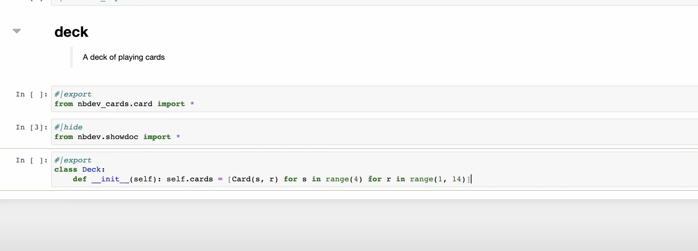

# Core import for prompt maker


<!-- WARNING: THIS FILE WAS AUTOGENERATED! DO NOT EDIT! -->

# Basic Imports

``` python
from fastcore.all import L
```

------------------------------------------------------------------------

<a
href="https://github.com/AnswerDotAI/fastcore/blob/main/fastcore/foundation.py#LNone"
target="_blank" style="float:right; font-size:smaller">source</a>

### L

>  L (items=None, *rest, use_list=False, match=None)

*Behaves like a list of `items` but can also index with list of indices
or masks*

------------------------------------------------------------------------

<a
href="https://github.com/AnswerDotAI/MonsterUI/blob/main/monsterui/franken.py#LNone"
target="_blank" style="float:right; font-size:smaller">source</a>

### H1

>  H1 (*c:fastcore.xml.FT|str, cls:enum.Enum|str|tuple=(), **kwargs)

*H1 with styling and appropriate size*

<table>
<colgroup>
<col style="width: 6%" />
<col style="width: 25%" />
<col style="width: 34%" />
<col style="width: 34%" />
</colgroup>
<thead>
<tr>
<th></th>
<th><strong>Type</strong></th>
<th><strong>Default</strong></th>
<th><strong>Details</strong></th>
</tr>
</thead>
<tbody>
<tr>
<td>c</td>
<td>fastcore.xml.FT | str</td>
<td></td>
<td>Contents of H1 tag (often text)</td>
</tr>
<tr>
<td>cls</td>
<td>enum.Enum | str | tuple</td>
<td>()</td>
<td>Classes in addition to H1 styling</td>
</tr>
<tr>
<td>kwargs</td>
<td>VAR_KEYWORD</td>
<td></td>
<td></td>
</tr>
<tr>
<td><strong>Returns</strong></td>
<td><strong>FT</strong></td>
<td></td>
<td><strong>H1(…, cls=‘uk-h1’)</strong></td>
</tr>
</tbody>
</table>

# Initializing app with live debug mode.

# Basic components and temp for import

------------------------------------------------------------------------

<a
href="https://github.com/Gaurav-Adlakha/prompt_maker/blob/main/prompt_maker/core.py#L29"
target="_blank" style="float:right; font-size:smaller">source</a>

### apply_preset

>  apply_preset (preset_type)

# code

------------------------------------------------------------------------

<a
href="https://github.com/Gaurav-Adlakha/prompt_maker/blob/main/prompt_maker/core.py#L37"
target="_blank" style="float:right; font-size:smaller">source</a>

### generate_prompt_content

>  generate_prompt_content (criteria, components, model='openai/gpt-4o')

------------------------------------------------------------------------

<a
href="https://github.com/Gaurav-Adlakha/prompt_maker/blob/main/prompt_maker/core.py#L59"
target="_blank" style="float:right; font-size:smaller">source</a>

### parse_llm_response

>  parse_llm_response (content)

index page

------------------------------------------------------------------------

<a
href="https://github.com/Gaurav-Adlakha/prompt_maker/blob/main/prompt_maker/core.py#L68"
target="_blank" style="float:right; font-size:smaller">source</a>

### get

>  get (preset:str='')

------------------------------------------------------------------------

<a
href="https://github.com/Gaurav-Adlakha/prompt_maker/blob/main/prompt_maker/core.py#L83"
target="_blank" style="float:right; font-size:smaller">source</a>

### get_progress

>  get_progress (session_id:str)

------------------------------------------------------------------------

<a
href="https://github.com/Gaurav-Adlakha/prompt_maker/blob/main/prompt_maker/core.py#L90"
target="_blank" style="float:right; font-size:smaller">source</a>

### generate

>  generate (request)

``` python
@rt("/generate", methods=["POST"])
async def generate(request):
    form_data = await request.form()
    criteria,components,model = form_data.get("criteria", ""),form_data.getlist("components"),form_data.get("model", "gpt-3.5-turbo")
    role_text,task_text,format_text,examples_text = form_data.get("role_text", ""),form_data.get("task_text", ""),form_data.get("format_text", ""),form_data.get("examples_text", "")
    if not criteria.strip(): return Div("Please enter some criteria first!", cls='text-red-500')
    session_id = str(uuid.uuid4())
    progress_state[session_id] = {"progress": 10, "done": False}
    form_json = json.dumps({"criteria": criteria, "components": components, "model": model, "role_text": role_text, "task_text": task_text, "format_text": format_text, "examples_text": examples_text, "session_id": session_id})
    return Div(Progress(value=10, hx_get=f"/progress/{session_id}", hx_trigger="load, every 500ms", hx_swap="outerHTML"), Div(id="final-output", hx_post=f"/generate-result", hx_trigger="load delay:100ms", hx_vals=form_json))
```

------------------------------------------------------------------------

<a
href="https://github.com/Gaurav-Adlakha/prompt_maker/blob/main/prompt_maker/core.py#L103"
target="_blank" style="float:right; font-size:smaller">source</a>

### generate_result

>  generate_result (request)

<figure>

<figcaption aria-hidden="true">image.png</figcaption>
</figure>
